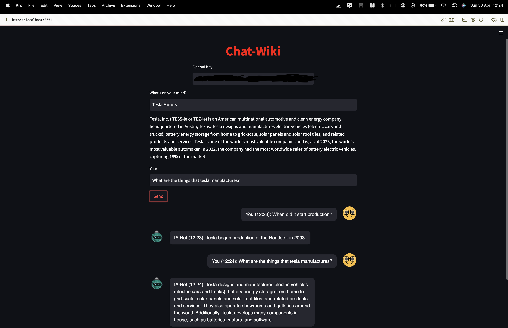

# Chat-Wiki

<p>This code is a Streamlit app that implements a chatbot that uses Wikipedia articles as its knowledge base. The app allows users to search for a topic of their choice, and then chat with the bot to ask questions related to that topic. </p>



## Installation

To run this app, you need Python 3.6 or later.

* Clone the repository to your local machine:

```
git clone https://github.com/your-username/Chat-Wiki.git
```

* Install packages

```
pip install -r requirements.txt
```

* Run the app

```
streamlit run streamlit_bot.py
```

* Enter your OpenAI API key when prompted.

## Usage
1. Type in your query in the text box and press Enter.
2. The app will retrieve a summary of the Wikipedia article related to your query, as well as display a text box for you to type in your message to the chatbot.
3. Type in your message and click the "Send" button to see the chatbot's response.


